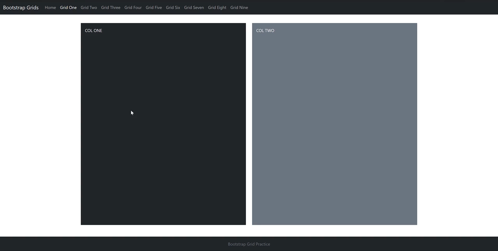

# Bootstrap5 Project
## *Bootstrap is a popular and powerful frontend framework for responsive webdevelopment*<hr>

## Technologies Used:
- Shell and scripting language: Powershell
- IDE: Visual Studio Code  2019
- Frontend: HTML5, CSS, Bootstrap 5
- Version Control: GitHub, GitHub for Desktop

<hr>

## Challenges
- Adding formatting practices not included in tutorial video

<hr>

## Introduction
### *Scope of the Projcect*

*This project will contain introductory information as well as exercises utilizing Bootsrap v5*

### Bootstrap Grids

- Bootstrap utilizes a grid system that supports six responsive breakpoints
- Breakpoints are based on min-width medi queries and effect the breakpoint and all thoase above it
- you can control container and column sizind and behavior by each breakpoint
- Containers center and horizontally pad your content
  - .container will be used for responsive pixel width
  - .container-fluid will be used for 100% will be used for responsive containers
- Rows are wrappers for columns and each column has horizontal padding, or gutters, for space control
- Columns are incredibly flexible and there are 12 template columns available per row
- Gutters are also responsible and customizable; Gutter classes are available across all breakpoints
  - horizontal gutters are changed with .gx-* classes
  -  vertical gutter with .gy-* classes
  -  all gutters are changed with the .g-* classes
  -   .g-0 can be used to remove all gutters
<hr>

### Styling the Landing Page Text

- In order to style the landing page text we must move to the main container under the nav bar container
- our text is placed in the within the main container
- in order to center the text, containers div class will be adjusted like so:
  ```
  <div class="container text-center">
  ```


- We'll then colorize the container by adding a class to the the sub title:
  ```
  <h3 class="text-white">
  ```


- in order to adjust the margins will will edit the div class again like so:
  ```
  <div class="container text center mt-5>
  ```
  - in this instance m stands for margin and t stands for top
  

- Next we will adjust the Main title by adding a class to the header tag to center it, enlarge it, and colorize it
  ```
  <h1 class=text-center display-1>
  ```


- We will now change the font by including a link to our font source above our style sheet
  ```
  <link rel="stylesheet" href="https://use.typekit.net/mhj5wdi.css">
  ```


- Next we will add CSS styling so the html document will accept the font changes
  ```
  .homeText{
    font-family: modesto-open-shadow, sans-serif;
    font-weight: 400;
    font-style: normal;
    color: rgb(195, 255, 0);
  }
  ```

- Finally we will add the homeText class to our Main Title by including the new style class in the header tag:
  ```
  <h1 class="text-center display-1 homeText>
  ```
<hr>

## Grid 1



#### *During this section we will be building a page with a two column grid*
<hr>

### Things to Remember

- Everything in bootstrap is built upon the grid system, which is a row and twelve columns
  
- each row must take up at least tweleve units, therefore we are building a page with two six-unit columns


## Credits
### Project References

- <a href="https://learn.coderfoundry.com">Coder Foundry Complete .Net Coding Bootcamp</a>
     
### Frontend
- <a href="https://getbootstrap.com/docs/5.0/getting-started/introduction/">Bootstrap 5 Docs</a>
